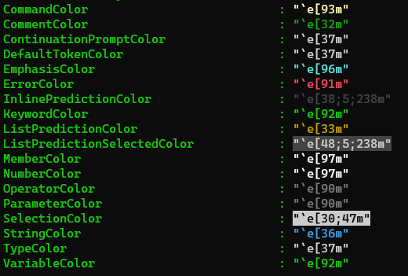

# Visual Studio Code Powershell Terminal Output Text Color

## Original question

> My powershell terminal suddenly changed its header text color from green to white color.
>
> Actions Taken: Reinstalled visual studio, deleted .code settings/config directory after uninstallation.
>
> I want to return the Green and White color to easily distinguish the output result.

## My Solution

There might be several reasons for this:

1. If this is also affecting your PowerShell console, it's probably related to PSReadLine and your PowerShell Profile. If this is the case, have a look at `Get-PSReadLineOption` to compare your settings and Set-PSreadLine.



More info about PSReadLine: [Set-PSReadLineOption | Microsoft Learn](https://learn.microsoft.com/en-us/powershell/module/psreadline/set-psreadlineoption?view=powershell-7.3)

Customizations can be stored in your powershell profile, which can be edited in VSCode with this oneliner:

```powershell
code $PROFILE
```

2. Your terminal color settings in VSCode have been edited. Using [Ctrl]+[Shift]+[P], search for the option `Terminal: Change color...` There is an option in there called `reset to default` Please be aware you need to have a terminal session opened in VSCode for the options to appear

3. The default profile for terminal changed. Using [Ctrl]+[Shift]+[P], search for the option `Terminal: Select default profile`